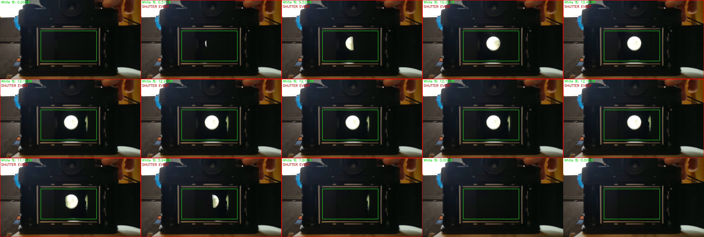

# Camera Shutter Speed Analyzer

A tool for analyzing camera shutter speeds from video recordings. This utility processes video files to detect and measure the duration of shutter events, which can be used to determine the actual shutter speed of cameras.

## Overview

This tool works by analyzing a region of interest (ROI) in a video where a camera's shutter. It detects frames where the brightness exceeds a threshold, groups consecutive bright frames into events, and calculates the duration of each event to determine the shutter speed.

## Features

- Analyze specific regions of interest in videos
- Support for slow-motion videos with real FPS correction
- Customizable brightness thresholds
- Time range selection for analysis
- Detailed reports with shutter speed measurements
- Visualization of results with plots
- Debug mode for frame-by-frame inspection
- Automatic detection of shutter events

## Requirements

- Python 3.x
- OpenCV (cv2)
- NumPy
- Matplotlib
- FFmpeg (for metadata extraction)

## Installation

1. Clone this repository:
   ```
   git clone https://github.com/yourusername/shutter-speed-analyzer.git
   cd shutter-speed-analyzer
   ```

2. Install the required dependencies:
   ```
   pip install opencv-python numpy matplotlib
   ```

3. Ensure FFmpeg is installed on your system:
   - For Ubuntu/Debian: `sudo apt-get install ffmpeg`
   - For macOS with Homebrew: `brew install ffmpeg`
   - For Windows: Download from [ffmpeg.org](https://ffmpeg.org/download.html)

## Usage

Basic usage:

```
python process.py VIDEO_FILE --roi X1 Y1 X2 Y2 --threshold THRESHOLD --white-percentage PERCENTAGE
```

Example:

```
python3 process.py in.mp4 --roi 371 281 877 556 --threshold 44 --white-percentage 0.01 --real-fps 240 --start-time 33 --end-time 120
```

### Parameters

- `VIDEO_FILE`: Path to the video file to analyze
- `--roi X1 Y1 X2 Y2`: Region of interest coordinates (top-left and bottom-right)
- `--threshold VALUE`: Brightness threshold (0-255) for detecting white pixels
- `--white-percentage VALUE`: Percentage of white pixels required to consider a frame as part of a shutter event
- `--start-time SECONDS`: Time in seconds to begin analysis
- `--end-time SECONDS`: Time in seconds to stop analysis
- `--real-fps FPS`: Actual capture frame rate for slow-motion videos
- `--debug`: Enable debug mode to save thresholded frames
- `--no-plot`: Skip generating visualization plots

## Output

The tool creates a timestamped output directory containing:

- A text report with detailed analysis results
- Visualization plots showing brightness over time and event durations
- Individual folders for each detected shutter event
- Frame-by-frame images for each event with context frames
- Debug frames (if debug mode is enabled)

Check out some of the output in the folder 'sample-output'. The part you really care about though is probably in "shutter_analysis_report.txt", and looks like this:

Event 1:
Frames: 1111 to 1122
Video time: 37163.59ms to 37531.55ms
Video duration: 401.41ms
Max brightness: 11.9
Event folder: shutter-event-001
Real-world duration: 50.00ms
Approximate shutter speed: 1/20 sec



## How It Works

1. The tool extracts a region of interest from each video frame
2. It converts this region to grayscale and applies a threshold
3. The percentage of white pixels is calculated for each frame
4. Frames exceeding the white percentage threshold are grouped into events
5. The duration of each event is calculated and converted to a shutter speed
6. For slow-motion videos, the tool adjusts calculations based on the real capture FPS

## Tips for Best Results

- Choose a ROI that clearly shows the camera's shutter or a flash reflection
- Adjust the threshold based on lighting conditions
- Use slow-motion video for more accurate measurements
- Specify the real FPS for slow-motion videos using `--real-fps`
- Use the debug mode to fine-tune your parameters
